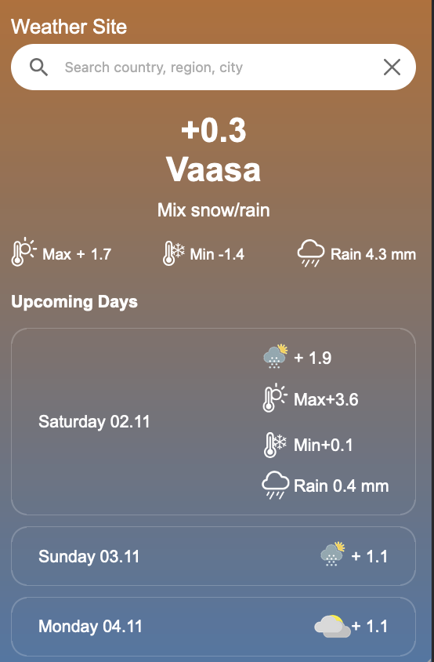

# Weather App 🌤️

A simple, responsive weather application built with TypeScript, React, and Vite. This app allows users to search for real-time weather information for any location, showing the current temperature, weather conditions, and a 7-day forecast.



## Technologies

This project is built with the following technologies:

- **React** - A JavaScript library for building user interfaces.
- **TypeScript** - A strongly typed programming language that builds on JavaScript, giving you better tooling at any scale.
- **Vite** - A fast development environment and build tool for modern web projects.
- **Google Places API** - Used for location search and autocomplete functionality.
- **Weatherbit API** - Provides weather data, including current weather, forecasts, and other meteorological information.

### Why These Technologies?

- **Vite** enables faster build times and a smooth development experience compared to traditional build tools.
- **TypeScript** ensures type safety, making the code more maintainable and less error-prone.
- **Google Places API** allows for accurate and responsive location-based search functionality.
- **Weatherbit API** is reliable and offers extensive weather data to enhance the app's features.

By combining these technologies, this app provides an optimized, maintainable, and interactive experience for users looking to get weather updates for various locations.


## Features

- 🌍 Search weather by city, country, or region.
- ☀️ Display current temperature, weather condition, max/min temperatures, and rain probability.
- 📅 View a 7-day weather forecast.
- 🖥️ Responsive design, optimized for both mobile and desktop.

## Installation

To get a local copy up and running, follow these steps:

### Prerequisites

- **Node.js** (v14 or higher)
- **npm** or **yarn**

### Clone the Repository


```bash
git clone https://github.com/miccci/weather-app.git
cd weather-app
```

### Install Dependencies

Using npm:
```bash
npm install
```

Using yarn:
```bash
yarn install
```

### Environment Variables

This project requires environment variables to configure API keys and other settings. Follow the steps below to set them up:

1. Create a `.env` file in the root of the project.
2. Add the required environment variables to the `.env` file. The following variables are needed:

   ```plaintext
   VITE_GOOGLE_PLACES_API_KEY=your_api_key_here
   VITE_WEATHER_API_KEY=your_api_key_here

### Start the app

```bash
npm run dev
```
or

```bash
yarn dev
```
